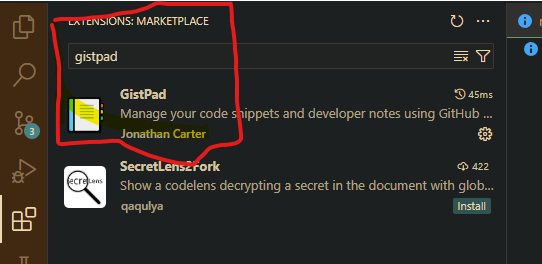
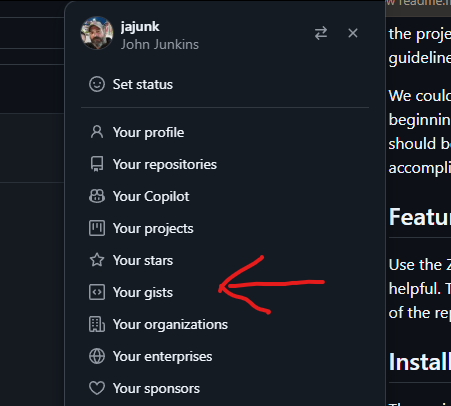

# Acreetion OS Documentation Plan

## Table of Contents
- [Acreetion OS Documentation Plan](#acreetion-os-documentation-plan)
  - [Table of Contents](#table-of-contents)
  - [Introduction](#introduction)
  - [Features](#features)
  - [Installation](#installation)
  - [Contributing](#contributing)
  - [License](#license)
  - [Contact](#contact)

## Introduction
Welcome to the AcreetionOS Documentation Plan. This repository is intended for gathering and styling standard boilerplate documentation for the project. It includes readme templates, guidelines, contributor guidelines, issue templates, and similar documents.

Leaving each repository owner to create ad hoc solutions for repo management can be confusing for new users. A streamlined and organized system should be easy and fast to put together. The goal is to have the simplest system that still accomplishes the goals, allowing us to focus on coding rather than writing readmes.

## Features
Use the Zulip Documentation Channel for deeper discussions. Use issues on this repository to suggest edits, and pull requests are always welcome. There are too many existing repositories for one person to fix everything, so the repo owner should handle the details of their repo.

## Installation
The easiest way to install local versions of the templates is to manage GitHub gists and use GistPad. This allows you to easily generate the simplest and most common docs, keeping you in the IDE without needing to search for templates in the repositories.

## Contributing
Boilerplate and templates should be created via issues and discussed in the issue itself. Policy and broader discussions should happen in Zulip.

## License
Only open-source industry-standard templates and documentation standards are accepted. No commercial templates.

## Contact
Look in the Zulip Documentation Channel for conversations and topics.
